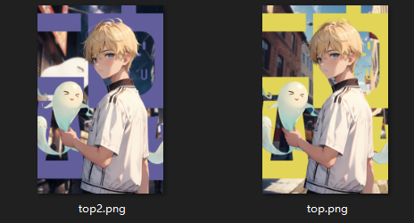
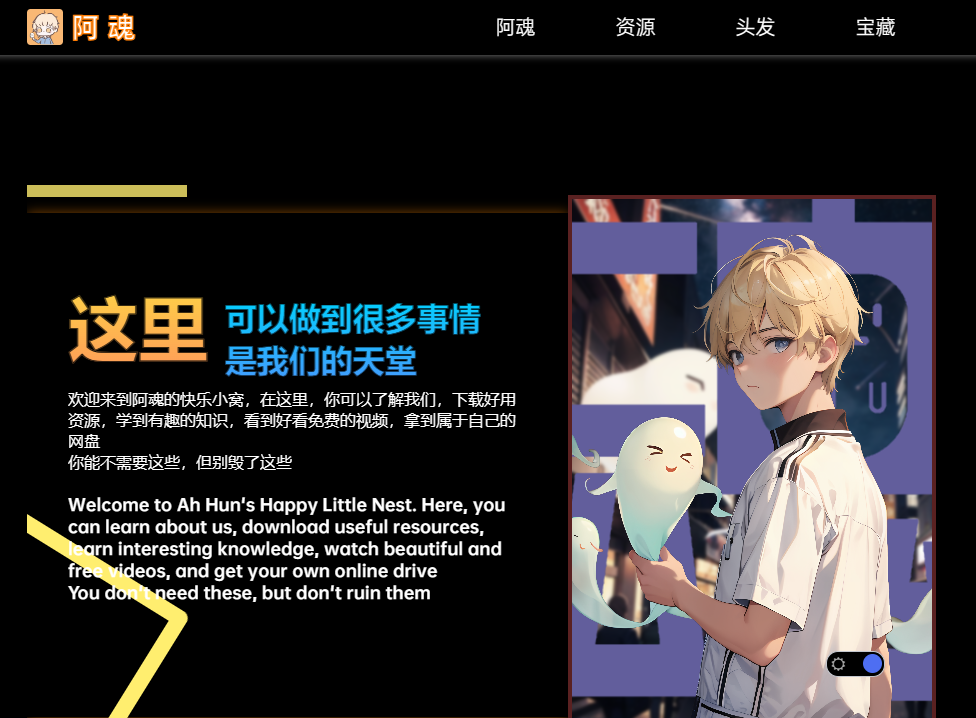

# 个人主页介绍

## 没别的，纯纯自己改着玩的，用于搭建自己的个人网站，B站UP叫：[阿魂不在线](https://space.bilibili.com/1079805307)（做游戏视频的）

## 纯纯自学高中生，[是将此主页内容修改而来的](https://www.bilibili.com/video/BV19Y4y1B7Z5)，侵删

### 删减了一些内容，加入了自己想要的东西，包括但不限于：适配暗色模式，更改了资源分享功能（纯前端静态的页面，没做接口只是用于小范围使用），加入了内置docsify的文档页，适配了手机浏览器（虽然很多显示bug，但不重要，本身就不是给手机端做的，但是依然在尽力适配），放上了多链接转跳页面，将原有的源码尽可能的加上了注释，看起来更舒服吧（），其他的就没有了，除了全局的菜单栏和首页的布局几乎是没有了以前的样子。

### 并且本网站项目免费开源在了GitHub：[首页项目](https://github.com/night-soul/shouye)欢迎各位大佬前来指点

#### 下面内容为更新日志：

> 2023年6月17日：

我在一天看网页的时候发现一个问题：在网页处于暗色模式的时候PC端的滚动条还是白色，特别难看

所以说在原本的CSS文件中添加了修改滚动条样式的代码：

`/* 修改滚动条的颜色 */

::-webkit-scrollbar {

 width: 12px; /* 设置滚动条的宽度 */

 background-color: #333; /* 设置滚动条的背景颜色 */

}

/* 修改滚动条滑块的样式 */

::-webkit-scrollbar-thumb {

 background-color: #666; /* 设置滚动条滑块的颜色 */

 border-radius: 6px; /* 设置滚动条滑块的圆角 */

}

/* 修改滚动条滑块在hover状态下的样式 */

::-webkit-scrollbar-thumb:hover {

 background-color: #999; /* 设置滚动条滑块在hover状态下的颜色 */

}

/* 修改滚动条轨道的样式 */

::-webkit-scrollbar-track {

 background-color: #222; /* 设置滚动条轨道的颜色 */

}

/* 修改滚动条轨道在hover状态下的样式 */

::-webkit-scrollbar-track:hover {

 background-color: #333; /* 设置滚动条轨道在hover状态下的颜色 */

}`

自学Stable Diffusion然后用PS修改替换了原本的个人介绍的主图：

页面效果：

